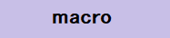

# prime number pattern

<h3>
If mod(N,P)=0=True 
  
N=All odd numbers 
 
P=All prime numbers 
  
P^2+Σ2P=mod(N,P)=0=True 
=None prime numbers 
  
∴P=mod(N,P)=False
</h3>
 

 

 
<a href="http://vf73ew.blogspot.jp/2011/01/riemanns-zeta-function.html">Riemann's zeta function</a> is based on Sieve of Eratosthenes.
 
I have found <a href="http://vf73ew.blogspot.jp/2011/01/the-pattern-of-prime-numbers.html">the pattern of prime numbers</a> which is the same with Sieve of Eratosthenes.
 
<a href="https://github.com/27dvz3279/prime2011/blob/master/prp1.pdf">It is fractal and infinite.</a> 
  

